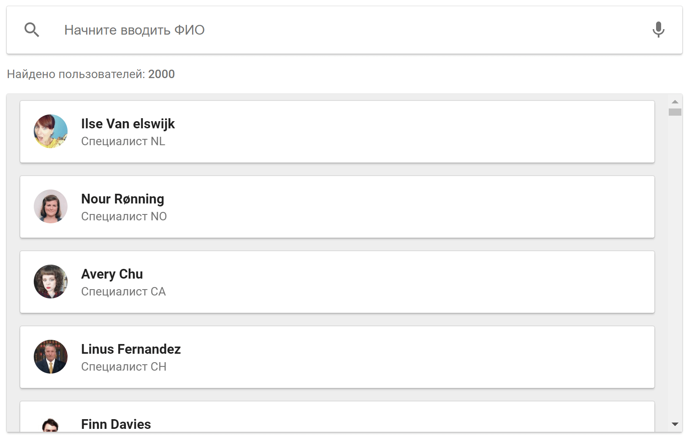

# User List | \<ims-user-list>

[Demo ↗](https://maksimyurkov.github.io/ims-user-list/demo/)

[](https://vaadin.com/components/vaadin-grid)

[User List](https://elements.01.ht/item/ims-user-list/2) - элемент предназначенный для отображения списка пользователей системы.

Элемент представляет из себя [веб-компоненту](https://developer.mozilla.org/ru/docs/Web/Web_Components), инкапсулирован и может быть размещен в вашей системе без риска затронуть окружение(внешние скрипты и стили).

На данный момент полностью поддерживается только система [WebTutor](https://webtutor.ru/).

Для работы User List в других системах, достаточно по аналогии написать серверную часть, представляющую из себя один небольшой файл (пример в `/api`).

Подробное описание User List доступно по [ссылке](https://elements.01.ht/item/ims-user-list/2).

## Быстрый старт

Независимо от того, новичок вы или опытный пользователь, начать использовать User List легко.

### WebTutor

1. Разместите [ims-user-list](https://github.com/maksimyurkov/ims-user-list) в директории **/wt/web/node_modules/@maksimyurkov/ims-user-list** вашей системы.

   Используйте один из вариантов:

   * [npm](https://www.npmjs.com/) `npm install @maksimyurkov/ims-user-list`

   * распаковать .zip архив
     * [последний релиз](https://github.com/maksimyurkov/ims-user-list/archive/master.zip)
     * [все релизы](https://github.com/maksimyurkov/ims-user-list/releases)

2. Разместите HTML код, в **Шаблоне документа** WebTutor:

```html
<!-- START ims-user-list -->
<script src="/node_modules/@maksimyurkov/ims-user-list/dist/vendor/webcomponents-loader.js"></script>
<script nomodule src="/node_modules/@maksimyurkov/ims-user-list/dist/vendor/fetch.js"></script>
<script nomodule src="/node_modules/@maksimyurkov/ims-user-list/dist/vendor/babel-helpers.min.js"></script>
<script nomodule src="/node_modules/@maksimyurkov/ims-user-list/dist/vendor/regenerator-runtime.min.js"></script>
<ims-user-list></ims-user-list>
<script nomodule src="/node_modules/@maksimyurkov/ims-user-list/dist/ims-user-list.es5.js"></script>
<script type="module" src="/node_modules/@maksimyurkov/ims-user-list/dist/ims-user-list.js"></script>
<!-- END ims-user-list -->
```

3. Готово

## Настройка

### Генератор

Для настройки ims-user-list перейдите по ссылке в вашей системе:

`https://адрес.вашей.системы/node_modules/@maksimyurkov/ims-user-list/demo/generator.html`

### Options

Настройки элемента \<ims-user-list\> указываются в свойстве **options**. Вы можете задавать их напрямую, без необходимости использования генератора.

Задать options можно с помощью кода:

```html
<ims-user-list></ims-user-list>
<script>
document.querySelector("ims-user-list").options = {
    textAvatar: false
};
</script>
```

Объект **options** включает в себя следующие параметры:

#### rootURL

Type: `String`

Default: `/node_modules/@maksimyurkov/ims-user-list`

Путь до ims-user-list относительно корня публичной директории.

Параметр позволяет разместить ims-user-list в директории отличающейся от стандартной.

#### serverURL

Type: `String`

Default: `/node_modules/@maksimyurkov/ims-user-list/api/webtutor.html`

Путь до сервера к которому осуществляются запросы.

Можно осуществлять запросы к внешним системам.

#### serverURL

Type: `String`

Default: `/node_modules/@maksimyurkov/ims-user-list/api/webtutor.html`

Путь до сервера к которому осуществляются запросы.

Можно указывать URL и осуществлять запросы к внешним ресурсам.

#### width

Type: `String`

Default: `100%`

Ширина элемента.

#### height

Type: `String`

Default: `600px`

Высота элемента.

#### pageSize

Type: `Number`

Default: `300`

Количество загружаемых за запрос пользователей.

#### showAvatar

Type: `Boolean`

Default: `true`

Отображать аватар в списке пользователей.

#### textAvatar

Type: `Boolean`

Default: `true`

Использовать текстовый аватар в списке пользователей.

#### voiceInput

Type: `Boolean`

Default: `true`

Включить голосовой ввод.

#### showNoFoundImage

Type: `Boolean`

Default: `true`

Показывать изображение на странице "Не найдено".

#### showFound

Type: `Boolean`

Default: `true`

Отображать блок с количеством найденных пользователей.

#### oldBrowsersSupport

Type: `Boolean`

Default: `true`

Включить поддержку старых браузеров (добавляет необходимые для работы полифиллы).

#### demoMode

Type: `Boolean`

Default: `false`

Режим для демонстрации работы ims-user-list. В этом режиме данные берутся из файла `/demo/users.json`

#### usedData

Свойство объекта options с помощью которого можно указать данные возвращаемые с сервера.

usedData включает в себя:

##### avatarURL

Type: `Boolean`

Default: `true`

Возвращать URL до аватара.

##### displayName

Type: `Boolean`

Default: `true`

Возвращать отображаемое имя.

##### nickname

Type: `Boolean`

Default: `true`

Возвращать никнейм.

##### position

Type: `Boolean`

Default: `true`

Возвращать должность.

##### subdivision

Type: `Boolean`

Default: `true`

Возвращать подразделение.

##### email

Type: `Boolean`

Default: `true`

Возвращать email.

##### systemEmail

Type: `Boolean`

Default: `true`

Возвращать рабочий email.

##### phone

Type: `Boolean`

Default: `true`

Возвращать номер телефона.

##### mobilePhone

Type: `Boolean`

Default: `true`

Возвращать номер мобильного телефона.

##### address

Type: `Boolean`

Default: `true`

Возвращать адрес.

##### accountURL

Type: `Boolean`

Default: `true`

Возвращать ссылку на профайл пользователя.

#### localization

Свойство объекта options в котором храняться языковые переменные.

Список переменных:

**Название свойства**: Значение по умолчанию

* **Found users**: Найдено пользователей
* **Loading data**: Загрузка данных
* **Nothing found**: Ничего не найдено
* **Search**: Поиск
* **Clear Search Box**: Очистить поле поиска
* **Start typing the user's full name**: Начните вводить ФИО
* **Voice input**: Голосовой ввод
* **Not specified**: Не указано
* **Nickname**: Никнейм
* **Position**: Должность
* **Subdivision**: Подразделение
* **Email**: Email
* **Worker Email**: Рабочий Email
* **Phone**: Телефон
* **Mobile phone**: Мобильный телефон
* **Address**: Адрес
* **Read more**: Подробнее

#### customCSSProperties

Свойство объекта options в котором храняться CSS переменные позволяющие менять стили ims-user-list.

**Название свойства**: Значение по умолчанию

* **--ims-user-list-accent-color**: #83b735,
* **--ims-user-list-second-accent-color**: #039be5,
* **--ims-user-list-primary-text-color**: #212121,
* **--ims-user-list-secondary-text-color**: #737373,
* **--ims-user-list-blocks-border-radius**: 2px,
* **--ims-user-list-avatar-border-radius**: 50%,
* **--ims-user-list-link-color**: #4285f4,
* **--ims-user-list-search-background**: #ffffff,
* **--ims-user-list-search-border**: none,
* **--ims-user-list-search-box-shadow**: 0 2px 2px 0 rgba(0, 0, 0, 0.16), 0 0 0 1px rgba(0, 0, 0, 0.08),
* **--ims-user-list-grid-background**: #eeeeee,
* **--ims-user-list-grid-border**: none,
* **--ims-user-list-grid-box-shadow**: 0 2px 2px 0 rgba(0, 0, 0, 0.16), 0 0 0 1px rgba(0, 0, 0, 0.08),
* **--ims-user-list-grid-loading-background**: #ffffff,
* **--ims-user-list-grid-item-background**: #ffffff,
* **--ims-user-list-grid-item-border**: none,
* **--ims-user-list-grid-item-box-shadow**: 0 2px 2px 0 rgba(0, 0, 0, 0.16), 0 0 0 1px rgba(0, 0, 0, 0.08),
* **--ims-user-list-grid-item-ripple-color**: #737373,
* **--ims-user-list-dialog-background**: #ffffff,
* **--ims-user-list-dialog-user-info-tooltip-background**: #616161,
* **--ims-user-list-dialog-user-info-tooltip-text-color**: #ffffff

## Разработка

```sh
# Клонируйте репозиторий и установите зависимости
git clone https://github.com/maksimyurkov/ims-user-list
cd ims-user-list
npm install
npm run dev
```

После внесения изменений сделайте сборку проекта

```sh
npm run build
```

### Запуск демо локально

```sh
npm run demo
```

## Совместимость

Последние версии:

* Chrome
* Firefox
* Edge
* Opera
* IE11
* и другие

## Известные проблемы

#### Отсутствие поддержки Safari

Добавлении поддержки Safari при сборке проекта приводит к ошибке. Проблема решается.

#### Спиннер в IE11

Зависание спиннера модального окна в IE11.

## Содействие

Подробнее по [ссылке](https://github.com/maksimyurkov/ims-user-list/blob/master/CONTRIBUTING.md).

## Лицензия

Элемент распространяется на основе [Elements Personal Free License (EPFL)](https://github.com/01HT/elements-personal-free-license/tree/v1.0.0).

Для использования элемента на условиях [Elements Single Commercial License (ESCL)](https://github.com/01HT/elements-single-commercial-license/tree/v1.0.0) приобретите соответствующую лицензию по [ссылке](https://elements.01.ht/item/ims-user-list/2).
